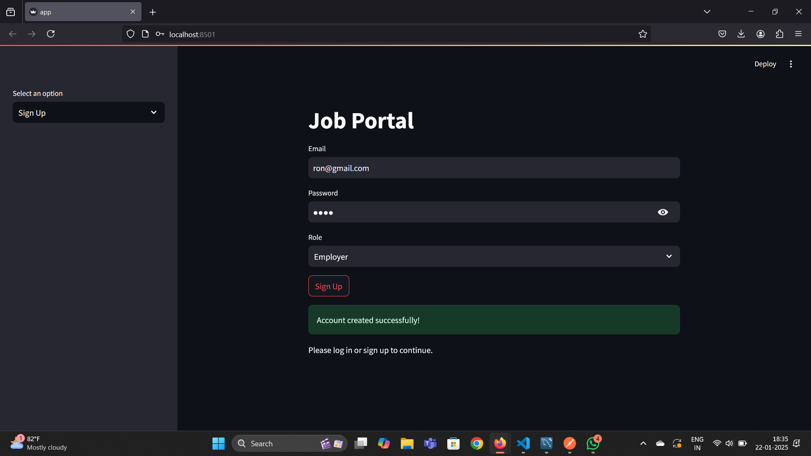
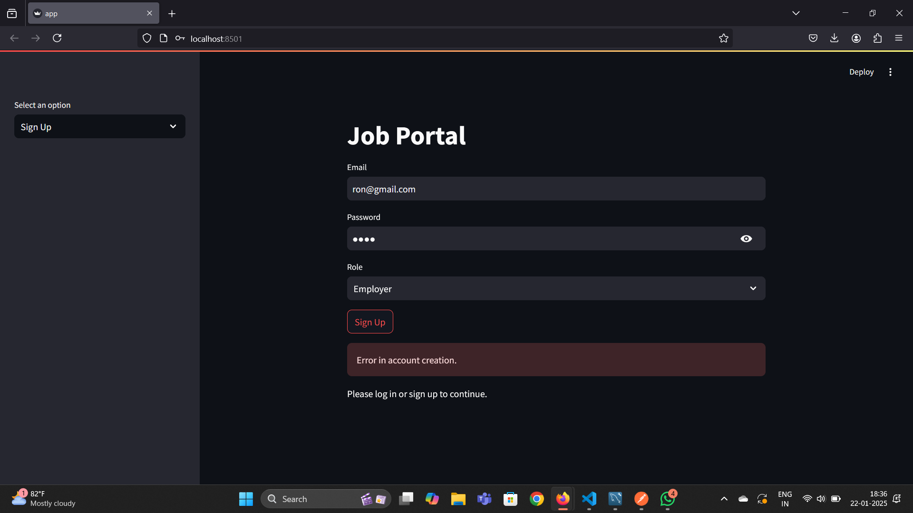
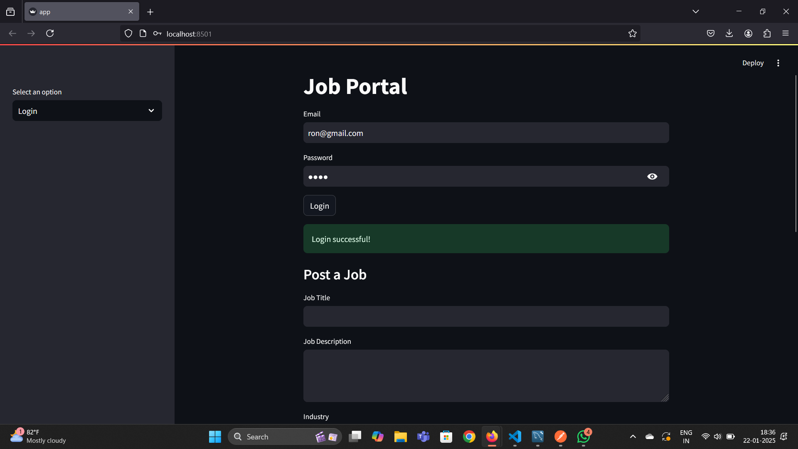
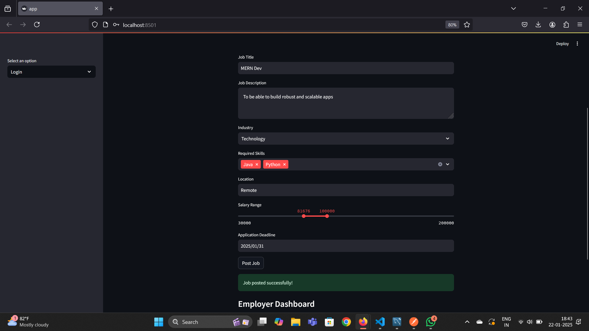
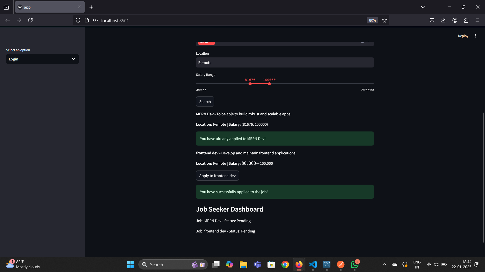
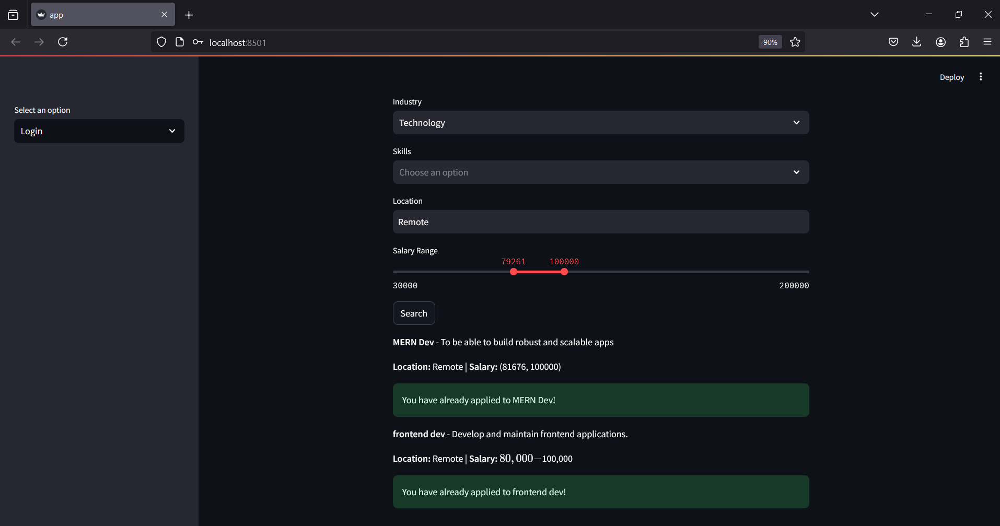
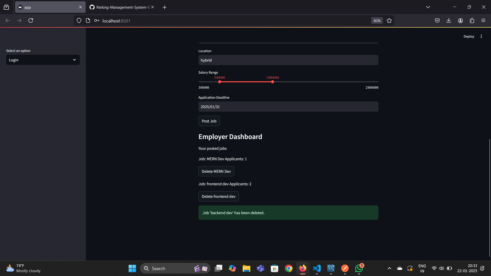

# Online Job Portal - Backend

## Project Setup Instructions

Follow the steps below to set up and run the backend of the Online Job Portal.

### Prerequisites

Make sure you have the following installed on your system:

- Python 3.8 or higher
- Git

### Step 1: Clone the Repository

Start by cloning the backend GitHub repository to your local machine:

```bash
git clone https://github.com/.git
cd backend
```

### Step 2: Create and Activate a Virtual Environment

It's recommended to create a virtual environment to manage dependencies:

```bash
python -m venv venv
```

Activate the virtual environment:

- **For Windows:**

  ```bash
  .\venv\Scripts\activate
  ```

- **For macOS/Linux:**

  ```bash
  source venv/bin/activate
  ```

### Step 3: Install Required Packages

Install all required Python packages from the `requirements.txt` file:

```bash
pip install -r requirements.txt
```

### Step 4: Set Up the Backend (FastAPI)

1. **Navigate to the backend directory** (if not already there):

   ```bash
   cd backend
   ```
2. **Start the FastAPI server:**

   ```bash
   uvicorn main_app:app --reload
   ```

   This will start the FastAPI server at `http://127.0.0.1:8000`.

3. **Verify the API is running:**

   Open your browser and navigate to `http://127.0.0.1:8000/docs` to access the FastAPI documentation.

### Step 5: Testing the Backend

**API Testing with Postman:**

   - Open Postman and import the collection provided in the repository.
   - Run the test requests to verify API endpoints.

<br>

# API Documentation

### 1. **Signup a User**

**Endpoint:** `POST /signup/`  
**Description:** Register a new user either.

**Request Body:**

```json
{
  "id": "id02",
  "email": "user@example.com",
  "password": "securepassword",
  "role": "Employer"
}
```

**Response:**

- **Success:**
  ```json
  {
    "id": "id02",
    "email": "user@example.com",
    "role": "Employer"
  }
  ```
- **Failure (Email already registered):**
  ```json
  {
    "detail": "Email already exists"
  }
  ```

### 2. **Login**

**Endpoint:** `POST /login/`  
**Description:** Authenticate a user and return a token.

**Request Body:**

```json
{
  "email": "user@example.com",
  "password": "securepassword"
}
```

**Response:**

- **Success:**
  ```json
  {
    "token": "your_access_token",
    "role": "your_role",
    "id": "id"
  }
  ```
- **Failure (Invalid credentials):**
  ```json
  {
    "detail": "Invalid credentials"
  }
  ```

### 3. **Post a Job**

**Endpoint:** `POST /jobs?token=token`  
**Description:** Post a job if your role is Employer.

**Request Body:**

```json
{
 "id": "job02",
  "title": "frontend dev",
  "description": "Develop and maintain frontend applications.",
  "employer_id": "",
  "industry": "Healthcare",
  "required_skills": "[\"React\", \"HTML\", \"JS\"]",
  "location": "Remote",
  "salary_range": "$80,000 - $100,000",
  "deadline": "2025-12-31"
}
```

**Response:**

- **Success:**
  ```json
  {
    "employer_id": "953b402dd8b911efb60e3003c83d00e2",
    "id": "job02",
    "required_skills": "[\"React\", \"HTML\", \"JS\"]",
    "salary_range": "$80,000 - $100,000",
    "title": "frontend dev",
    "description": "Develop and maintain frontend applications.",
    "industry": "Healthcare",
    "location": "Remote",
    "deadline": "2025-12-31"
    }
  ```
- **Failure (Invalid credentials/token):**
  ```json
  {
    "detail": "Could not validate credentials"
  }
  ```

### 4. **Get the Job(s)**

**Endpoint:** `GET /jobs?params`  
**Description:** Post a job if your role is Employer.


**Response:**

- **Success:**
  ```json
  [
    {
        "id": "job02",
        "employer_id": "id22",
        "required_skills": "[\"React\", \"HTML\", \"JS\"]",
        "salary_range": "$80,000 - $100,000",
        "title": "frontend dev",
        "description": "Develop and maintain frontend applications.",
        "industry": "Healthcare",
        "location": "Remote",
        "deadline": "2025-12-31"
    }
   ]
  ```

### 5. **Delete a Job**

**Endpoint:** `GET /jobs/job_id`  
**Description:** Delete a job by its id.


**Response:**

- **Success:**
  ```json
  {
    "message": "Job deleted successfully"
  }
  ```

### 6. **Post an application for the job**

**Endpoint:** `POST /applications`  
**Description:** Post a job if your role is Employer.

**Request Body:**

```json
{
    "id": "appn_post1",
    "job_id": "job01",
    "seeker_id": "hid2",
    "status": "Pending",
    "application_date": "2025-01-22"
}
```

**Response:**

- **Success:**
  ```json
  {
    "job_id": "job01",
    "seeker_id": "hid2",
    "application_date": "2025-01-22",
    "status": "Pending",
    "id": "appn_post1"
  }
  ```
- **Failure:**
  ```json
  {
    "detail": "You have already applied for this job"
  }
  ```

### 7. **Get the application(s)**

**Endpoint:** `GET /jobs/job_id`  
**Description:** Get the applications by user id or job id.


**Response:**

- **Success:**
  ```json
  [
    {
        "job_id": "job01",
        "seeker_id": "hid2",
        "application_date": "2025-01-22",
        "status": "Pending",
        "id": "appn_post1"
    },
    {
        "job_id": "job01",
        "seeker_id": "8e476289d8b911ef8cb83003c83d00e2",
        "application_date": "2025-01-22",
        "status": "Pending",
        "id": "d59f74df-d8c2-11ef-a2ca-3003c83d00e2"
    }
   ]
  ```

# Online Job Portal - Frontend

## Project Setup Instructions

### Prerequisites

Make sure you have the following installed on your system:

- Python 3.8 or higher
- Git

### Step 1: Clone the Repository

Start by cloning the frontend GitHub repository to your local machine:

```bash
git clone .git
cd frontend
```

### Step 2: Create and Activate a Virtual Environment

It's recommended to create a virtual environment to manage dependencies:

```bash
python -m venv venv
```

Activate the virtual environment:

- **For Windows:**

  ```bash
  .\venv\Scripts\activate
  ```

- **For macOS/Linux:**

  ```bash
  source venv/bin/activate
  ```

### Step 3: Install Required Packages

Install all required Python packages from the `requirements.txt` file:

```bash
pip install -r requirements.txt
```

### Step 4: Run the Streamlit Application

1. **Navigate to the frontend directory** (if not already there):

   ```bash
   cd frontend
   ```

2. **Run the Streamlit application:**

   ```bash
   streamlit run app.py
   ```

   This will start the Streamlit frontend application and open it in your default web browser.

   
Now, Job Portal frontend is set up and ready to run!
## Screenshots of the interface







